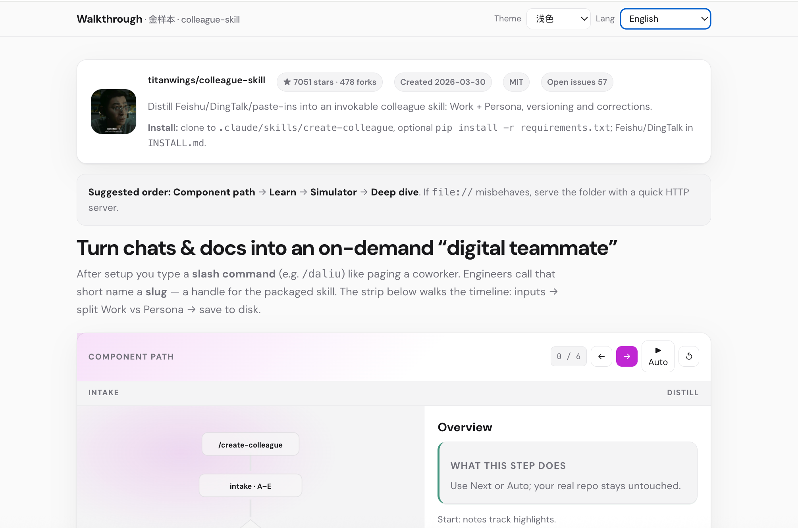
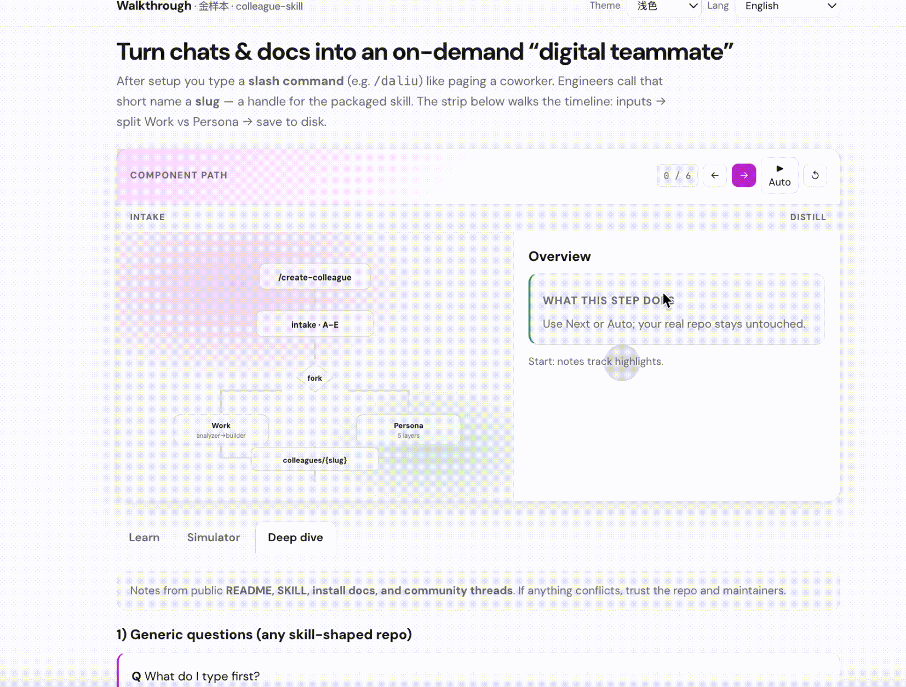
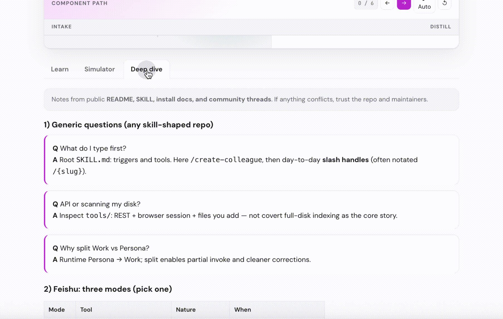

# Web Learning GitHub

## What it is & who it’s for

An **agent skill** for **Cursor, Claude Code, Windsurf, OpenClaw**, and similar hosts: point it at an **Agent Skill repo on GitHub** and get a **single self-contained HTML** that traces the UI/UX path—**what you do in the product** vs **what the host and model load next**. Meant for **learning and orientation**, not for turning an app codebase into a shipped web product.

**Who is it for?** Vibe coders and anyone on GitHub who wants to see **where to install**, **what triggers the skill**, and **which files load in what order**. READMEs are often high-level while real entrypoints sit under hooks, `references/`, or subcommands—this page is **one scrollable map** instead of many small Markdown hops.

中文：[README.zh-CN.md](README.zh-CN.md) · Repository: [YeJe-cpu/web-learning-github](https://github.com/YeJe-cpu/web-learning-github)

---

## Demo & what the generated page contains

Below, a single-page example built from [**titanwings/colleague-skill**](https://github.com/titanwings/colleague-skill) ([`web/colleague-skill-prototype-gold.html`](web/colleague-skill-prototype-gold.html)). Media layout: **(1)** a **static PNG** of the top of the page—project title, avatar, stars, blurb, **plus the upper half of the component-path strip**; **(2)–(3)** are **GIFs** for **component path** and **Simulator** interactions. **English / 中文** in the **same file**.



*Asset **1** (PNG): top of the viewport—name, avatar, stars, intro, and a **partial** view into the **component path** area.*



*Asset **2** (GIF): full **component path** strip—stepping, controls, side notes.*



*Asset **3** (GIF): **Simulator** tab—stepped bubbles for post-install chat flow.*

<table>
<colgroup><col style="width:11%"><col style="width:24%"><col style="width:65%"></colgroup>
<thead><tr><th>Block</th><th>What you see</th><th>What you get from the full HTML (worth opening)</th></tr></thead>
<tbody>
<tr><td><strong>Hero</strong></td><td>Title, reading order</td><td>Know in seconds whether to follow the path first or the long copy—less guessing.</td></tr>
<tr><td><strong>Meta</strong></td><td>Stars, forks, link</td><td>Instant “this is the repo I meant.”</td></tr>
<tr><td><strong>Component path</strong></td><td>Flow SVG, rails, step controls, side notes</td><td><strong>The spine</strong>: trigger → branches/steps → disk, like scrubbing a timeline—easier to follow than a wall of README prose.</td></tr>
<tr><td><strong>Learn</strong></td><td>Long sections, lists</td><td>Background, install, and limits <strong>in one continuous read</strong> for people who want the full picture once.</td></tr>
<tr><td><strong>Simulator</strong></td><td>Bubble steps</td><td><strong>How a real session might sound</strong> after install—less imagination tax.</td></tr>
<tr><td><strong>Deep dive</strong></td><td>Heavy Q&amp;A, caveats</td><td>Permissions, deps, and how this differs from “todo-only” tools—<strong>cheap failures here</strong> before you commit in production.</td></tr>
<tr><td><strong>After install</strong></td><td>Foldable checklist</td><td>Aligned with <strong>component path</strong> and <strong>simulator</strong> so you can execute in order.</td></tr>
<tr><td><strong>Tree + bullets</strong></td><td>File tree, README-style bullets</td><td>Where artifacts land and how the author sells the project—last glance before you try or fork.</td></tr>
</tbody>
</table>

**Full interactive page:** `git clone` this repo → open `web/colleague-skill-prototype-gold.html` in a browser and click through / switch tabs. Another reference page, `web/lark-minutes-tasks-walkthrough.html`, is for a different product story—clone locally to open it; this README does not include a second set of images for it.

---

## How to use (humans & agents)

1. Copy this repo (or only the **`web-learning-github`** folder) into your host’s skills directory.  
2. In chat, **paste the target skill’s GitHub URL** and say you want **this skill (Web Learning GitHub)** to generate that one-page walkthrough.

| Host | Typical path |
|------|----------------|
| Cursor | e.g. `.agents/skills/web-learning-github/` |
| Claude Code | e.g. `~/.claude/skills/web-learning-github/` |
| Windsurf | follow current product docs |
| OpenClaw | e.g. `~/.openclaw/skills/` — [Skills](https://docs.openclaw.ai/skills/) |

**You might say:** “Repo is `https://github.com/someone/some-skill` — use **Web Learning GitHub** to give me **one self-contained HTML** that explains install, trigger, and file order.” Add “**bilingual EN/中文** on the page” if you need a language toggle.

**Agents** follow **`SKILL.md`**, **`SKILL.zh-CN.md`**, and **`references/`**. After cloning this bundle, the usual output path is **`web/<owner>-<repo>.html`** (one target repo → one file unless you agree otherwise).

---

## Repo layout

```
web-learning-github/
├── SKILL.md
├── SKILL.zh-CN.md
├── references/
├── assets/                         # README screenshots & GIFs
├── web/
│   ├── colleague-skill-prototype-gold.html    # colleague-skill demo (titanwings/colleague-skill)
│   ├── lark-minutes-tasks-walkthrough.html    # other reference scenario (lark-minutes-tasks)
│   └── .gitkeep
├── README.md
├── README.zh-CN.md
├── LICENSE
└── CONTRIBUTING.md                 # notes for people who edit this skill repo
```

See [`references/README.md`](references/README.md) for `references/`.

---

## License

MIT — see [LICENSE](LICENSE).
