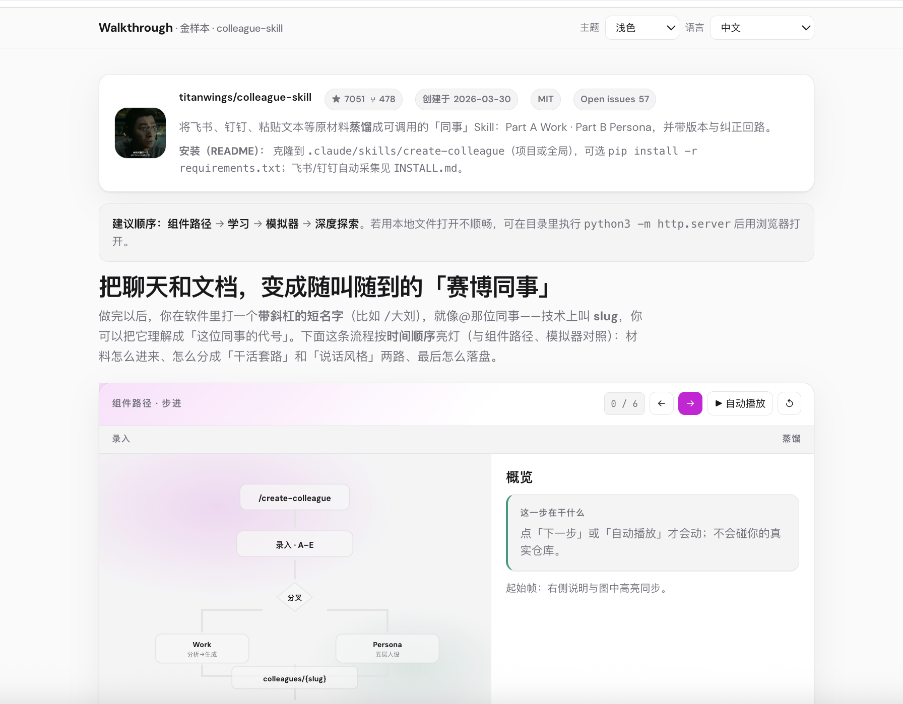
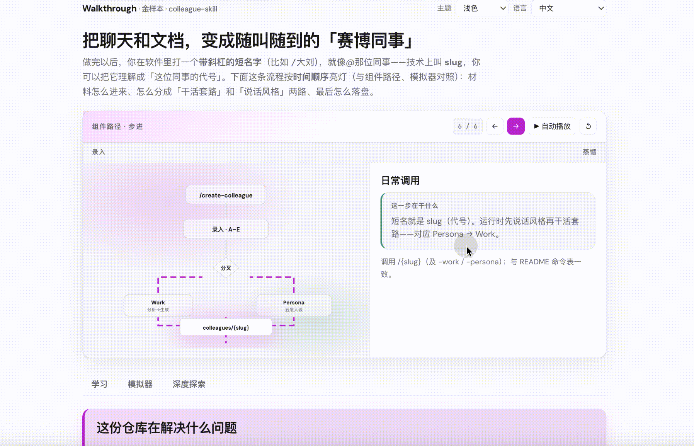
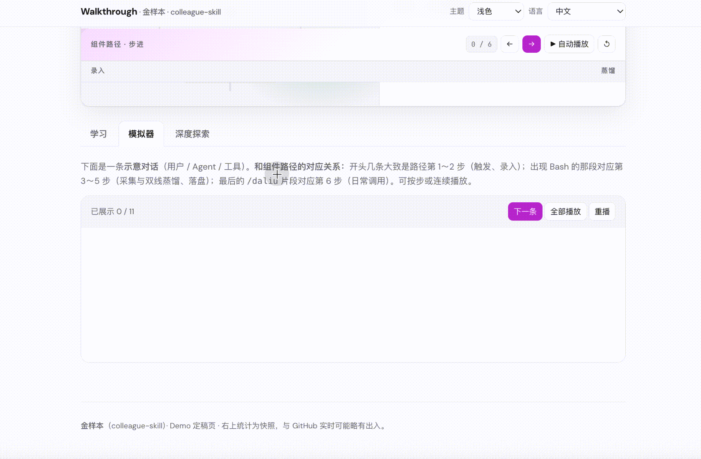

# Web Learning GitHub

## 这是啥，适合谁

跑在 **Cursor、Claude Code、Windsurf、OpenClaw** 等环境里的 **Agent skill**：对准 GitHub 上的 **Agent Skill 仓库**，生成 **单个自包含 HTML**，沿「你怎么操作」和「宿主 / 模型在背后读什么」把路径铺开——适合 **学习与捋清调用关系**，不是把业务代码一键变成上线网站。

**适合谁？** Vibe coder、常刷 GitHub、想搞清某个 skill 仓 **怎么装、怎么触发、文件谁先谁后** 的人。README 往往写得很概括，真实入口在 Hook、`references/` 或子命令里；这一页用 **可滚动的单文件** 把路径和幕后机制放在一起，少啃一堆 Markdown 标签页。

English：[README.md](README.md) · 仓库：[YeJe-cpu/web-learning-github](https://github.com/YeJe-cpu/web-learning-github)

---

## 演示和生成的页面里有什么

下面以 [**titanwings/colleague-skill**](https://github.com/titanwings/colleague-skill) 做成的单页示范为例（文件 [`web/colleague-skill-prototype-gold.html`](web/colleague-skill-prototype-gold.html)）。**三张媒体编号：1 = 静态截图；2、3 = 动图。** 图 **1** 覆盖视觉最上方：项目名称、头像、**Star**、简介等，并带到 **组件路径** 的半截画面；图 **2** 为 **组件路径** 动图；图 **3** 为 **模拟器** 动图。同一示范页内可切换 **English / 中文**。



*素材标号 **1**（PNG）：视觉最上方——项目名称、头像、Star、简介等，并带到 **组件路径** 区块的**半截**画面。*



*素材标号 **2**（GIF）：**组件路径** 整块——流程步进、控制条与右侧说明。*



*素材标号 **3**（GIF）：**模拟器** Tab——分步气泡、装好后在宿主里大致如何往下聊。*

<table>
<colgroup><col style="width:11%"><col style="width:24%"><col style="width:65%"></colgroup>
<thead><tr><th>模块</th><th>看得见什么</th><th>打开完整 HTML 多得到什么（值得点进来的点）</th></tr></thead>
<tbody>
<tr><td><strong>Hero</strong></td><td>标题、建议阅读顺序</td><td>几十秒搞清楚先看路径还是先看长文，减少盲读。</td></tr>
<tr><td><strong>Meta</strong></td><td>Star / Fork / 链接</td><td>立刻确认「就是我要看的那一个仓库」。</td></tr>
<tr><td><strong>组件路径</strong></td><td>大图流程、轨道字、步进按钮、右侧解说</td><td><strong>主骨架</strong>：触发 → 分叉/步骤 → 落盘，像进度条一样看懂先后；比纯文字 README 更不容易迷路。</td></tr>
<tr><td><strong>学习</strong></td><td>多段长文、列表、问题拆解</td><td>把背景、安装、能力边界<strong>摊在一页里读完</strong>，适合想一次吃透的人。</td></tr>
<tr><td><strong>模拟器</strong></td><td>气泡逐步演示</td><td><strong>装好后在宿主里会怎么问、怎么走</strong>，少靠脑补。</td></tr>
<tr><td><strong>深度探索</strong></td><td>大量 Q&amp;A、注意事项</td><td>权限、依赖、和「只产出清单不执行」之类产品<strong>差在哪里</strong>，先在这里排雷再决定要不要上会。</td></tr>
<tr><td><strong>装好后怎么用</strong></td><td>可折叠清单</td><td>与上面的<strong>组件路径</strong>、<strong>模拟器</strong>一句对齐，按清单对照操作。</td></tr>
<tr><td><strong>树 + 要点</strong></td><td>目录树、bullet</td><td>文件落盘长什么样、作者怎么概括价值，最后一眼决定去留。</td></tr>
</tbody>
</table>

**完整页面怎么体验：** `git clone` 本仓库 → 用浏览器打开 `web/colleague-skill-prototype-gold.html` 即可逐步点击、切换 Tab。另有一份其它业务场景的参考单页 `web/lark-minutes-tasks-walkthrough.html`，同样需克隆到本地后打开；本 README 未为它单独配图。

---

## 怎么用（人怎么用、Agent 怎么执行）

1. 把本仓库（或其中的 **`web-learning-github`** 文件夹）拷到你宿主规定的 **skills** 目录。  
2. 在对话里 **直接粘贴目标 skill 的 GitHub 链接**，并说明要用 **本 skill（Web Learning GitHub）** 生成那一页 walkthrough。

| 宿主 | 常见路径 |
|------|-----------|
| Cursor | 如项目里的 `.agents/skills/web-learning-github/` |
| Claude Code | 如 `~/.claude/skills/web-learning-github/` |
| Windsurf | 以官方文档为准 |
| OpenClaw | 如 `~/.openclaw/skills/`，见 [Skills](https://docs.openclaw.ai/skills/) |

**你可以这么说：**「仓库是 `https://github.com/谁/什么` ，用 Web Learning GitHub 给我生成**单文件 HTML**，把安装、触发、读文件顺序讲清楚。」需要 **中英切换** 就加一句「页面要双语切换」。

**Agent** 按 **`SKILL.md` / `SKILL.zh-CN.md`** 和 **`references/`** 执行；克隆本技能包后，默认会写出 **`web/<拥有者>-<仓库名>.html`**。

---

## 目录结构

```
web-learning-github/
├── SKILL.md
├── SKILL.zh-CN.md
├── references/
├── assets/                         # 本 README 用到的截图与动图
├── web/
│   ├── colleague-skill-prototype-gold.html    # 同事 skill 示范（titanwings/colleague-skill）
│   ├── lark-minutes-tasks-walkthrough.html    # 另一参考场景（lark-minutes-tasks）
│   └── .gitkeep
├── README.md
├── README.zh-CN.md
├── LICENSE
└── CONTRIBUTING.md
```

`references/` 说明见 [`references/README.md`](references/README.md)。

---

## 许可证

MIT — 见 [LICENSE](LICENSE)。
